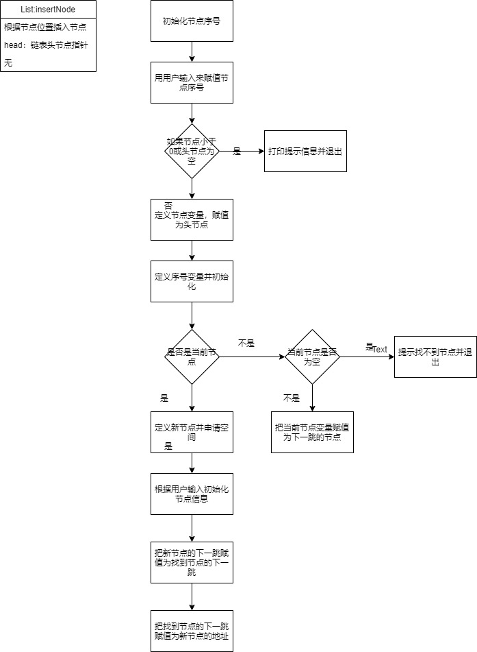

## 实验一：链表

### 节点结构体

首先我们定义学生信息结构体，为了方便，我们使用`typedef`定义为枚举类型，学生信息包含两部分：学生姓名和学生年龄，一个是char型数组，一个是int型变量

```c
typedef struct stuInfo{ //学生信息
    char stuName[10];  //学生姓名
    int Age;  //学生年龄
}ElemType;
```

我们再把学生信息当作节点中的一个信息，定义一个节点，除学生信息以外，还得定义一个节点指针，指针，指向下一个节点，为了方便，我们定义一个指针变量，来存储节点指针：

```c
typedef struct node{ //节点结构体
    ElemType data;  //学生信息
    struct node *next;  //下一个节点的地址
}ListNode, *ListPtr;
```

### 创建节点

CreateList的作用是创建一个链表，也就是创建一个头节点。其中的`DEAFULT_NAME`和`DEAFULT_AGE`使用`#define` 定义。


```cc
ListPtr CreateList()
{
    ListPtr listNode = (ListPtr)malloc(sizeof(ListNode));  //定义一个节点变量
    ElemType newStu;  //定义一个学生信息结构体变量
    newStu.Age = DEAFULT_AGE;  //给学生信息变量赋年龄值
    strcpy(newStu.stuName,DEAFULT_NAME); //给学生信息变量赋姓名值
    listNode->data = newStu; //把学生节点加入到链表节点中
    listNode->next = NULL; //把学生节点的下一个节点的地址设置为空
    return listNode; //返回节点
}
```

### 打印链表

打印链表的功能是打印出除头节点以外所有节点的学生信息。主要思路是通过while循环遍历链表的每一个节点，直到节点为空时退出。


```c
void PrintList(ListNode *head)
{
    ListPtr node = head->next; //从头节点的下一个开始
    while (node != NULL) //如果当前节点不为空，就可以打印，否则不打印
    {
        printf("name %s, age %d\n", node->data.stuName, node->data.Age);//打印学生名字和年龄
        node = node->next; //把节点指向下一个节点
    }
}
```

### 在链表末尾添加节点

要想在末尾添加节点，重点在于如何找到最后一个节点，最后一个节点有一个别人没有的特征——它的下一个节点的地址为空，利用它在加上一个while循环，我们就可以得到一个链表的最后一个节点了。我们再新建一个节点，把这个节点接到最后一个节点上就可以了。


```c
void addNode(ListNode *head)
{
    ListPtr node = head;  //定义一个节点地址变量，把头节点的地址赋值给它
    while (node->next !=NULL) // 如果节点的下一个节点的地址不为空，则说明还没到最后一个节点
    {
        node  = node->next; // 把此刻的节点地址向后推
    }
    ListPtr add= (ListPtr)malloc(sizeof(ListNode));  //申请一段节点大小的内存空间
    printf("请输入要在末尾添加的节点的姓名和年龄，用空格隔开\n"); //提示输入节点学生信息
    scanf("%s %d", add->data.stuName, &(add->data.Age)); //接受用户输入的节点信息
    add->next = NULL;  //把加入的节点的下一跳节点地址设置为空
    node->next = add; //把原本链表最后的节点的下一跳地址设置为新加入的节点地址
    PrintList(head); // 打印链表，提示添加情况
}
```

### 插入节点

插入节点的关键是如何找到要插入的地方，这里采用序号作位置，使用一个while循环，如果碰到序号与想要的一致，就跳出循环，再把这个节点的下一个节点的地址赋值给新节点，把新节点的地址赋值给这个节点的下一跳指针变量里。



```c
void InsertList(ListNode *head)
{
   int index = 1;  //初始化节点位置
   printf("链表里的值有:\n"); //提示链表内容
   PrintList(head); 
   printf("你想插入到哪一个前面？\n"); //提示插入节点
   scanf("%d",&index); //接收用户输入的节点位置
   if(index< 0 || head == NULL)  //检查节点位置合法性，如果小于1或者链表不存在，报错
   {
       printf("插入失败，选择的位置不合法或者链表不存在");
       return;
   }
   ListPtr temp = head; //创建节点指针，以头节点为初始位置
   int i = 1; //初始化遍历节点位置到第一个
   while (i != index) //如果找到了节点位置，就退出循环，否则就继续循环
   {
       if (temp == NULL) //如果当前节点为空，说明到头了，还没找到节点
       {
           printf("找不到你想要的位置");
           return;
       }
       i ++;
       temp = temp->next;
   }
   ListPtr newNode = (ListPtr)malloc(sizeof(ListNode)); //跳出循环，并且还在程序里，说明已经找到了节点，申请节点大小的内存空间
   scanf("%s %d", newNode->data.stuName,&newNode->data.Age); //接收用户输入的节点信息
   newNode->next = temp->next; //把前面节点的下一个节点位置赋值给新节点的下一个节点位置指针变量
   temp->next = newNode; //把前面节点的下一跳节点位置设置为新插入节点的地址
}
```

