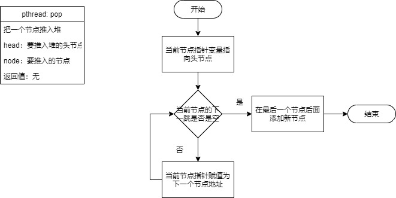

### 实验五：线程复制目录文件


### 堆栈操作

#### 定义结构体

首先我们定义一个文件夹结构体，它的变量值有一个文件夹路径，是char型数组，我们在以这个结构体为节点的信息，构建一个节点结构体，为了方便使用，我还定义了一个节点指针。

```c
typedef struct DIRs
{
    char dir_path[1024];
}Dir;

typedef struct NODE
{
    Dir dir;
    struct NODE *next;
}Node, *NodePtr;
```

#### 创建节点

创建节点的任务是，根据输入的文件夹地址，产生一个文件夹节点，这个函数可以用来创建一个堆（本质是创建一个头节点，这里的堆是用链表构成的），也可以用来创建一个普通的节点。


```c
NodePtr createNode(char dir_path[])
{
    NodePtr node = (NodePtr)malloc(sizeof(Node)); //申请节点空间
    Dir dir;
    strcpy(dir.dir_path, dir_path); //把文件夹路径赋值给文件夹结构体
    node->dir = dir;  //把结构体赋值给新节点
    node->next = NULL; //把新节点的下一跳赋值为空
    return node;
}
```

#### 推入节点

推入节点的操作的任务是把新接添加到堆链表的最后一个节点后面，主要思路是先找到最后一个节点，再把新节点接到最后一个节点后面。



```cc
void push(NodePtr head, NodePtr node)
{
    NodePtr temp =  head;  //节点指向头节点
    while(temp->next != NULL) //如果节点的下一跳不为空，说明还没到最后一个节点
    {
        temp = temp->next; //往下找
    }
    temp->next = node; //跳出循环表示已经找到最后一个节点，接上新节点
}
```

#### 弹出节点

从堆里弹出最上面的节点，本质是从链表尾拿出一个节点，分三部分，第一先找到倒数第二个节点，第二拿到尾节点，第三，把倒数第二个节点的下一跳改为`NULL`。


```c
NodePtr pop(Node *head)
{
    NodePtr temp = head;
    while(temp->next->next != NULL)
    {
        temp = temp->next;
    }
    NodePtr res = temp->next;
    temp->next = NULL;
    return res;
}
```

#### 打印节点


```c
void printNode(NodePtr node)
{
    printf("path is %s\n", node->dir.dir_path);
}
```

#### 打印堆


```c
void printHeap(NodePtr head)
{
    NodePtr temp = head;
    while(temp !=NULL)
    {
        printNode(temp);
        temp = temp->next;
    }
}
```

#### 判断是否为空


```c
int isEmpty(NodePtr head)
{
    if(head->next == NULL)
        return 1;
    return 0;
}
```

### 处理文件夹

#### 创建线程

```c
void dealDir(char *dir_path)
{
    pthread_t id;
    pthread_create(&id, NULL, read_dir, dir_path);
    pthread_join(id,NULL);
}
```

#### 线程函数

```c
void *read_dir(void *dir_path)
{
    char *path;
    path =  (char *) dir_path;
    DIR *cwd = NULL;                                        //路径文件指针
    struct dirent *det = NULL;                              //记录读到的文件信息
    struct stat statbuf = {0};                              //记录文件的属性
    printf("New path %s\n", path);
    chdir(path);                                            //!非常重要，否则无法获取文件属性
    cwd = opendir(path);                                    //打开目录
    while (NULL != (det = readdir(cwd)))                    //遍历当前目录
    {
        stat(det->d_name, &statbuf);//保存符号链接指向文件本身的信息进statbuf
        if (strcmp(det->d_name,".") !=0 && strcmp(det->d_name,"..")!=0) {
            if (S_ISDIR(statbuf.st_mode)) {
                printf("dir %s\n", det->d_name);
                push(head, createNode(mergeString(path, det->d_name)));
            } else {
                dealFileInDir(mergeString(path, det->d_name));
            }
        }
    }
    while(isEmpty(head) == 0)
    {
        NodePtr deal = pop(head);
        dealDir(deal->dir.dir_path);
        free(deal->dir.dir_path);
    }
    closedir(cwd);
}
```

### 处理文件

#### 创建线程

```c
void dealFileInDir(char *file_path)
{
    pthread_t id;
    pthread_create(&id, NULL, copyFile, file_path);
    pthread_join(id,NULL);
}
```

#### 线程函数

```c
void *copyFile(void *arg)
{
    char *file;
    file =  (char *) arg;
    printf("%s\n", file);
    copy_file_function(file, mergeString(dst, get_file_name(file)));
}
```

### 拷贝函数

```c
void copy_file_function(char *src, char *dst)
{
    int in_fd = -1, out_fd = -1; //定义文件标识符

    if( ( in_fd = open( src, O_RDONLY ) ) == -1 ) { //以只读方式打开源文件
        perror( "file open" );
        exit( -1 );
    }

    if ( ( out_fd = creat( dst, COPYMODE ) ) == -1 ) { //以拷贝模式打开目标文件
        perror( "file copy" );
        exit( -1 );
    }

    char n_chars[BUF];  //设置文件缓冲数组
    int len = 0;
	//读取源文件，如果源文件读取没有到头，读到头为0，发生错误为-1
    while( ( len = read( in_fd, n_chars, sizeof( n_chars ) ) ) > 0 ) { 
        if ( write( out_fd, n_chars, len ) != len ) { //写入目标文件
            printf( "文件:%s发生copy错误\n", dst );
            exit( -1 );
        }
    }

    if( len == -1 ) {   //如果发生错误
        printf( "读取%s文件错误\n", src );
        exit( -1 );
    }

    if( close( in_fd ) == -1 ) {      //关闭源文件
        printf( "文件%s关闭失败\n", src );
        exit( -1 );
    }
    if( close( out_fd ) == -1 ) {   //关闭目标文件
        printf( "文件%s关闭失败\n", dst );
        exit( -1 );
    }
}
```

### 一些工具

#### 合并两个字符串

```c
char *mergeString(char first[], char last[])
{
    if (first[sizeof(first-1)] != '/' && last[0] != '/')
    {
        char *temp = "/";
        first = mergeString(first,temp);
    }
    char *name = (char *) malloc(strlen(first) + strlen(last));
    strcpy(name, first);
    strcat(name, last);
    return name;
}
```

#### 从路径中得到文件名

```c
char* get_file_name(char *file_path)
{
    char *fn = (char *)malloc(sizeof(fn[0]));
    char *p;
    //上句假设以某种方式获得的全文件名在pathname中,"..."中只是举例
    strcpy(fn,(p=strrchr(file_path,'/')) ? p+1 : file_path);
    //上句函数第2实参这样写以防止文件在当前目录下时因p=NULL而出错
    return fn;
}
```

#### 帮助函数

```c
void do_help()
{
    printf("pthread --s source_path --t target_path\n");
}
```

### main函数

```c
int main(int argc, char *argv[])
{
    if (argc <5 ||strcmp(argv[1],"--s") !=0 || strcmp(argv[3],"--t") != 0)
    {
        do_help();
        return 0;
    }
    head = createNode("NULL");
    dst = argv[4];
    pthread_t id;
    pthread_create(&id, NULL, read_dir, argv[2]);
    pthread_join(id,NULL);
    return 0;
}
```